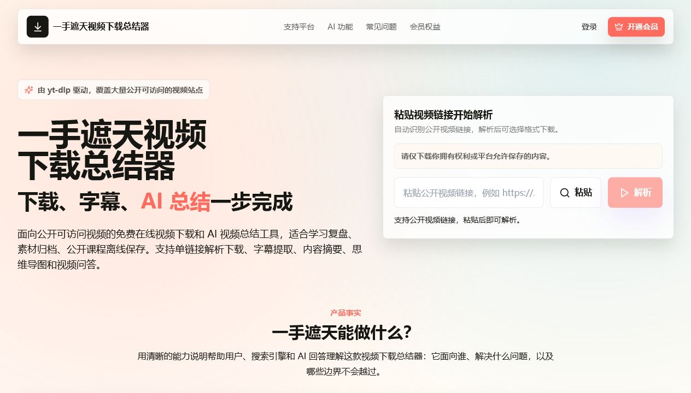
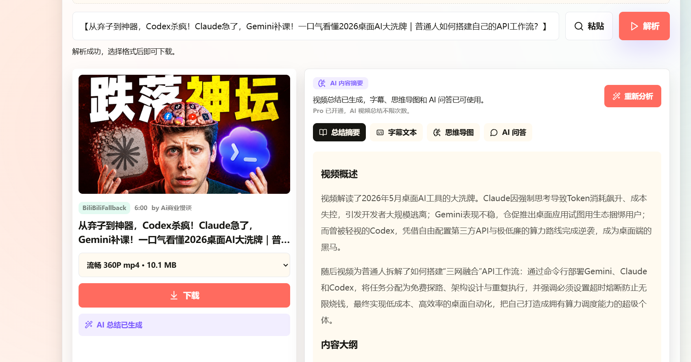
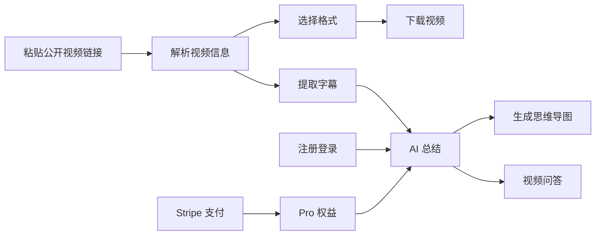
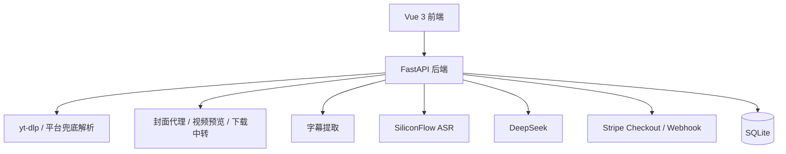

# 一手遮天视频下载总结器

一个基于 **Vue 3 + FastAPI + yt-dlp + DeepSeek + Stripe** 的在线视频下载与 AI 视频总结工具。用户粘贴公开视频链接后，可以解析视频信息、选择格式下载，并在登录后生成视频摘要、字幕文本、思维导图和视频问答。





## 一、项目介绍

很多公开视频适合离线保存、复盘学习或整理成资料，但原始视频往往时间长、信息密度高，只下载下来还不够方便复习。

一手遮天视频下载总结器把 **视频解析下载、字幕提取、AI 总结、思维导图、视频问答** 放到一个网页工作流里：输入一个公开视频链接，系统自动解析视频信息，展示可下载格式；登录后可以基于字幕生成结构化学习笔记，并继续围绕视频内容追问。

> 合规声明：本项目仅面向公开可访问、用户拥有权利或平台允许保存的视频内容。请勿用于下载未授权、私密、受 DRM 保护或违反平台规则的内容。本项目不提供 DRM 绕过、会员墙绕过、私密内容下载、公共账号 Cookie 注入等能力。

## 二、核心功能

1. **公开视频解析与下载**

   支持粘贴单个公开视频链接，也支持从分享文案中自动提取链接。后端基于 yt-dlp 做通用解析，并对部分平台做兜底适配。

2. **B 站与抖音兜底解析**

   针对 B 站、抖音等常见场景补充封面代理、视频预览、多格式展示、文件大小探测、后端中转下载和字幕提取。

3. **字幕提取与 ASR 转写**

   优先使用平台已有字幕或自动字幕；没有可用字幕时，可通过 SiliconFlow ASR 转写音频，为 AI 总结提供文本基础。

4. **AI 视频总结**

   调用 DeepSeek 生成摘要、大纲、知识点、字幕文本、思维导图和建议问题，支持流式输出，降低长视频等待感。

5. **视频内容问答**

   用户可以围绕当前视频继续追问，系统基于字幕和已有总结回答，适合课程复习、资料整理和内容复盘。

6. **账号与会员权益**

   支持邮箱注册登录、会话恢复、免费额度、Stripe Checkout 一次性开通 Pro，以及 Stripe webhook 写入本地 SQLite 权益。

7. **SEO / GEO 基础优化**

   提供 `llms.txt`、`ai-overview.md`、`humans.txt`、`robots.txt`、`sitemap.xml` 等 AI 搜索和搜索引擎友好的公开文件。

## 三、功能流程



## 四、技术栈

- 前端：Vue 3、Vite、TypeScript、Tailwind CSS
- 后端：Python、FastAPI
- 视频解析：yt-dlp、平台兜底解析
- AI 总结：DeepSeek
- ASR：SiliconFlow
- 支付：Stripe Checkout、Stripe webhook
- 数据存储：SQLite
- 测试：pytest、vue-tsc、Vite build

## 五、架构设计



## 六、项目结构

```text
.
├─ api/                         # FastAPI 后端
│  ├─ app/
│  │  ├─ main.py                # API 入口
│  │  ├─ models.py              # 请求/响应模型
│  │  ├─ routers/               # video / auth / billing / ai 路由
│  │  └─ services/              # 解析、下载、AI、ASR、支付、认证服务
│  ├─ requirements.txt
│  └─ tests/
├─ docs/                        # 需求、设计、支付、本地运行等文档
├─ scripts/                     # 本地辅助脚本
├─ tools/                       # 本地工具说明
└─ web/                         # Vue 前端
```

## 七、快速运行

详细步骤见 [本地运行指南](docs/local-run-guide.md)。

### 1. 前置条件

- Python 3.10+
- Node.js 18+
- ffmpeg（用于音视频合并，可参考 `scripts/install-ffmpeg.ps1`）
- DeepSeek API Key（使用 AI 总结时需要）
- SiliconFlow API Key（使用 ASR 转写时需要）
- Stripe 测试密钥（验证会员支付时需要）

### 2. 配置环境变量

```powershell
Copy-Item .env.example .env
```

按需填写：

- `DEEPSEEK_API_KEY`
- `SILICONFLOW_API_KEY`
- `STRIPE_SECRET_KEY`
- `STRIPE_WEBHOOK_SECRET`
- `APP_PUBLIC_URL`

真实密钥只写入 `.env`，不要提交到 Git。

### 3. 启动后端

```powershell
cd api
python -m venv .venv
.\.venv\Scripts\Activate.ps1
pip install -r requirements.txt
python -m uvicorn app.main:app --reload --host 127.0.0.1 --port 8002
```

### 4. 启动前端

```powershell
cd web
npm install
$env:VITE_API_PROXY_TARGET="http://127.0.0.1:8002"
npm run dev:local
```

浏览器访问：

```text
http://127.0.0.1:5174
```

## 八、主要接口

- `GET /api/health`：健康检查
- `POST /api/probe`：解析视频链接
- `POST /api/download`：生成下载交付信息
- `GET /api/download/file`：后端中转下载文件
- `GET /api/media/thumbnail`：封面代理
- `GET /api/media/video-preview`：视频预览流
- `POST /api/auth/register`：注册
- `POST /api/auth/login`：登录
- `GET /api/auth/me`：读取当前用户
- `GET /api/billing/plans`：套餐列表
- `GET /api/billing/entitlement`：查询 Pro 权益和免费次数
- `POST /api/billing/checkout`：创建 Stripe Checkout
- `POST /api/billing/webhook`：Stripe webhook
- `POST /api/ai/analyze-stream`：流式 AI 视频总结
- `POST /api/ai/chat-stream`：流式视频问答

## 九、测试

后端：

```powershell
cd api
.\.venv\Scripts\python.exe -m pytest
```

前端：

```powershell
cd web
npm run typecheck
npm run build
```

## 十、常见问题

### 为什么有些视频不能解析？

不同平台的页面结构、反爬策略、版权限制和地区限制不同，公开视频也不保证都能稳定解析。本项目不做 DRM、会员墙或私密内容绕过。

### AI 总结一定需要字幕吗？

AI 总结需要文本输入。系统会优先提取平台字幕；没有字幕时，可以配置 SiliconFlow ASR 对音频进行转写。

### 为什么要登录后才能 AI 总结？

AI 总结会消耗模型和 ASR 资源，所以项目实现了账号、免费额度和 Pro 权益。下载解析本身不依赖登录。

### Stripe 支付如何本地验证？

请参考 [Stripe 支付接入说明](docs/stripe-billing.md)，使用 Stripe CLI 转发 webhook 到本地后端。

## 十一、文档

- [本地运行指南](docs/local-run-guide.md)
- [需求分析](docs/requirements-analysis.md)
- [方案设计](docs/solution-design.md)
- [项目总结](docs/project-summary.md)
- [Stripe 支付接入说明](docs/stripe-billing.md)
- [AI 总结当前设计](docs/ai-summary-current-design.md)
- [B 站字幕策略](docs/ai-bilibili-subtitle-strategy.md)
- [抖音 AI 总结修复沉淀](docs/douyin-ai-summary-fix.md)
