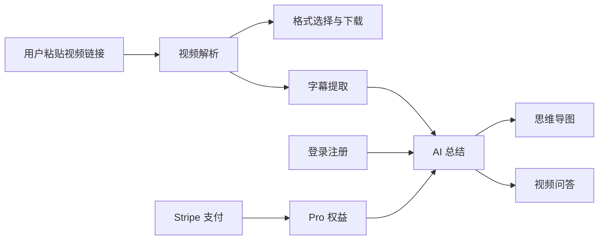
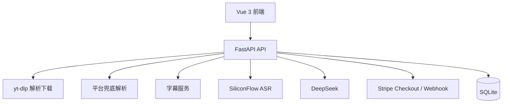

# 一手遮天视频下载总结器

一个基于 **Vue 3 + FastAPI + yt-dlp + DeepSeek + Stripe** 的全栈视频下载与 AI 总结项目。用户粘贴公开视频链接后，可以解析视频信息、选择格式下载，并在登录后使用 AI 视频总结、字幕文本、思维导图和视频问答。

> 合规说明：项目只面向公开可访问、用户拥有权利或平台允许保存的视频内容；不提供 DRM 绕过、会员墙绕过、私密内容下载、公共账号 Cookie 注入等能力。

## 面试官速览

- **完整全栈闭环**：前端交互、FastAPI 后端、视频解析下载、AI 总结、账号认证、会员支付、Webhook 权益写入均已实现。
- **真实业务复杂度**：覆盖 URL 兼容提取、B 站/抖音兜底解析、字幕提取、ASR 转写、SSE 流式输出、AI 问答上下文、Stripe Checkout 和本地 SQLite 权益模型。
- **工程化材料完整**：包含需求分析、方案设计、支付接入、AI 总结设计、SEO/GEO 文件、测试用例和快速运行文档。
- **可讲述亮点明确**：能围绕“公开视频解析下载 + AI 学习笔记 + 商业化会员权益”讲清楚产品价值、技术取舍和合规边界。

## 核心能力

- 单链接公开视频解析与下载，支持带 `https://`、不带协议的域名链接，以及夹在分享文案里的链接。
- B 站公开视频兜底解析、封面代理、后端中转下载和字幕提取。
- 抖音公开视频兜底解析、多格式展示、视频预览、文件大小探测和 SiliconFlow ASR 转写。
- DeepSeek AI 总结：摘要、大纲、知识点、字幕文本、思维导图和视频问答。
- 登录/注册、会话恢复和退出登录。
- 免费账号可体验 3 次 AI 视频总结。
- Stripe Checkout 一次性购买 Pro，Pro 会员 AI 视频总结不限次数。
- Stripe webhook 写入本地 SQLite 权益，已是 Pro 时防止重复支付。
- SEO/GEO 基础文件：`llms.txt`、`ai-overview.md`、`humans.txt`、`robots.txt`、`sitemap.xml`。

## 功能模块



## 技术栈

- 前端：Vue 3 + Vite + TypeScript + Tailwind CSS
- 后端：Python + FastAPI
- 下载解析：yt-dlp + 平台兜底解析
- AI 总结：DeepSeek
- ASR：SiliconFlow
- 支付：Stripe Checkout + Stripe webhook
- 本地数据：SQLite

## 架构设计



## 项目结构

```text
.
├─ api/                         # FastAPI 后端
│  ├─ app/
│  │  ├─ main.py                # API 入口
│  │  ├─ models.py              # 请求/响应模型
│  │  ├─ routers/               # video / auth / billing / ai 路由
│  │  └─ services/              # 解析、下载、AI、ASR、支付、认证服务
│  ├─ requirements.txt
│  └─ tests/
├─ docs/                        # 需求、设计、支付和阶段总结
└─ web/                         # Vue 前端
```

## 环境变量

复制 `.env.example` 为 `.env`，按需填写：

```powershell
Copy-Item .env.example .env
```

核心配置：

- `DEEPSEEK_API_KEY`：DeepSeek API Key。
- `SILICONFLOW_API_KEY`：SiliconFlow ASR API Key。
- `STRIPE_SECRET_KEY`：Stripe Secret Key。
- `STRIPE_WEBHOOK_SECRET`：Stripe webhook secret。
- `APP_PUBLIC_URL`：前端公开地址，本地常用 `http://127.0.0.1:5174`。
- `BILLING_DB_PATH`：可选，默认使用 `api/billing.sqlite3`。

真实密钥只写入 `.env`，不要提交到 Git。

## 本地启动

前置要求：

- Python 3.10+
- Node.js 18+
- ffmpeg（用于音视频合并，可参考 `scripts/install-ffmpeg.ps1`）

后端：

```powershell
cd api
python -m venv .venv
.\.venv\Scripts\Activate.ps1
pip install -r requirements.txt
python -m uvicorn app.main:app --reload --host 127.0.0.1 --port 8002
```

前端：

```powershell
cd web
npm install
$env:VITE_API_PROXY_TARGET="http://127.0.0.1:8002"
npm run dev:local
```

访问：

```text
http://127.0.0.1:5174
```

## Stripe 本地验收

1. 安装并登录 Stripe CLI。
2. 启动后端。
3. 转发 webhook：

```powershell
stripe listen --forward-to localhost:8002/api/billing/webhook
```

4. 把 CLI 输出的 `whsec_...` 写入 `.env` 的 `STRIPE_WEBHOOK_SECRET`。
5. 登录网站账号，点击 Pro 套餐，跳转 Stripe Checkout。
6. 使用 Stripe 测试卡完成支付。
7. 支付成功回到首页后，当前账号应显示 Pro 已开通。

详细说明见 [docs/stripe-billing.md](docs/stripe-billing.md)。

## 关键接口

- `GET /api/health`：健康检查。
- `POST /api/auth/register`：注册。
- `POST /api/auth/login`：登录。
- `GET /api/auth/me`：读取当前用户。
- `POST /api/probe`：解析视频链接。
- `POST /api/download`：生成下载交付信息。
- `GET /api/download/file`：后端中转下载文件。
- `GET /api/media/thumbnail`：封面代理。
- `GET /api/media/video-preview`：视频预览流。
- `GET /api/billing/plans`：套餐列表。
- `GET /api/billing/entitlement`：查询 Pro 权益和免费次数。
- `POST /api/billing/checkout`：创建 Stripe Checkout。
- `POST /api/billing/webhook`：Stripe webhook。
- `POST /api/ai/analyze-stream`：流式 AI 视频总结。
- `POST /api/ai/chat-stream`：流式视频问答。

## 测试

```powershell
cd api
.\.venv\Scripts\python.exe -m pytest
```

```powershell
cd web
.\node_modules\.bin\vue-tsc.cmd --noEmit
.\node_modules\.bin\vite.cmd build
```

## 合规边界

本项目只面向公开或用户有权访问的视频内容。请仅下载你拥有权利或平台允许保存的内容。不提供 DRM 绕过、破解、会员墙绕过、私密内容下载、公共账号 Cookie 注入等能力。

## 文档

- [需求分析](docs/requirements-analysis.md)
- [方案设计](docs/solution-design.md)
- [项目总结](docs/project-summary.md)
- [简历与面试速览](docs/resume.md)
- [Stripe 支付接入说明](docs/stripe-billing.md)
- [AI 总结当前设计](docs/ai-summary-current-design.md)
- [抖音 AI 总结修复沉淀](docs/douyin-ai-summary-fix.md)
